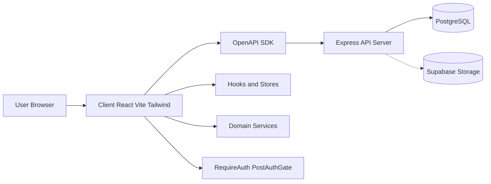

<div align="center">
  <h1 style="margin-bottom: 0.25rem;">Expense Tracker</h1>
  <p style="margin-top: 0; color: #6b7280;">Monorepo containing a React (Vite) client and an Express server.</p>
  <p>
    
    
    
  </p>
  <p>
    
    
    
    
  </p>
</div>

---

## Project Overview

Expense Tracker is a full‑stack web application to track personal finances. It helps you record expenses and incomes, categorize them, attach receipts, and visualize insights with a clean dashboard.

Key capabilities:

- 🔐 Authentication and onboarding (username, categories) with protected routes.
- 💸 Expenses and incomes management (CRUD), filters, charts, and PDF export of income receipts.
- 🗂️ Categories management with list/grid views, inline edit, and bulk actions.
- 🧾 Receipts storage and preview (image/PDF). Local static serving and optional Supabase Storage integration.
- 📊 Analytics dashboard (KPIs, monthly evolution, category breakdown).
- 🧩 Reusable UI library and Storybook docs.
- 🔗 OpenAPI‑driven client SDK so frontend and backend stay in sync.

Architecture (high level): The React client (Vite + React Router + Tailwind) calls the Express API through a generated SDK (`client/src/api`). The server exposes REST endpoints backed by PostgreSQL via Prisma, with middleware for security (`helmet`, `cors`) and uploads. Optional integrations include Google OAuth and Supabase for receipts.

---

## Table of Contents

- [Structure](#structure)
- [Tech Stack](#tech-stack)
- [Architecture](#architecture)
- [Quick Start](#quick-start)
- [Documentation](#documentation)
- [Environment](#environment)
- [OpenAPI](#openapi)
- [Deployment](#deployment)

<h2>Structure</h2>

```
expense-tracker/
  client/   # React + TS + Vite app (UI library + Storybook)
  server/   # Express API server
```

<h2>Tech Stack</h2>

- Client: React 19, TypeScript, Vite 7, Tailwind CSS 4, Storybook 9
- Server: Node.js, Express, PostgreSQL (via pg), Helmet, CORS, Morgan

## Architecture



<h2>Quick Start</h2>

1) Server

```bash
cd server
cp .env.example .env  # edit values as needed
npm install
npm run dev
```

By default, set `PORT=8080` to match the client SDK base (`http://localhost:8080/api`). If `PORT` is unset, the server falls back to `4000`.

2) Client

```bash
cd client
npm install
npm run dev
```

Vite dev server runs on http://localhost:5173 by default.

3) Storybook (optional)

```bash
cd client
npm run storybook
```

<h2>Documentation</h2>

- Client README: ./client/README.md
- Server README: ./server/README.md

<h2>Environment</h2>

- Server env template: `server/.env.example`
- Key vars: `PORT`, `DATABASE_URL`, `JWT_SECRET`, `CORS_ORIGIN`

## OpenAPI

- Spec file: `server/docs/Expense Tracker API.yaml`
- Regenerate client SDK from the spec (run from `client/`):

```bash
npm run api:generate
```

## Deployment

- Client can be deployed as static assets (e.g., Vercel). Ensure API base points to the deployed server.
- Server: provide `DATABASE_URL`, `JWT_SECRET`, `CORS_ORIGIN`, and (if used) Supabase/Google OAuth variables as per `server/.env.example`.

<!-- Project-specific contribution guidelines and CI/CD details live outside this file. -->