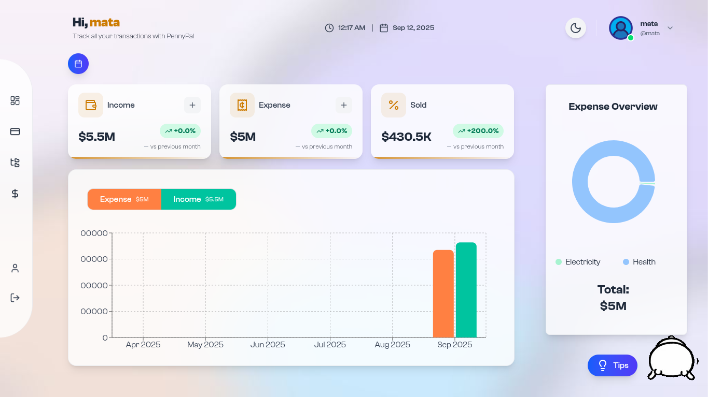
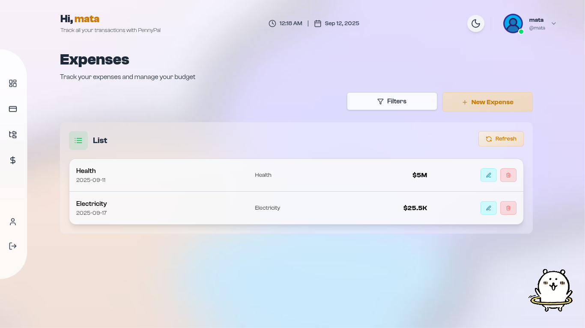
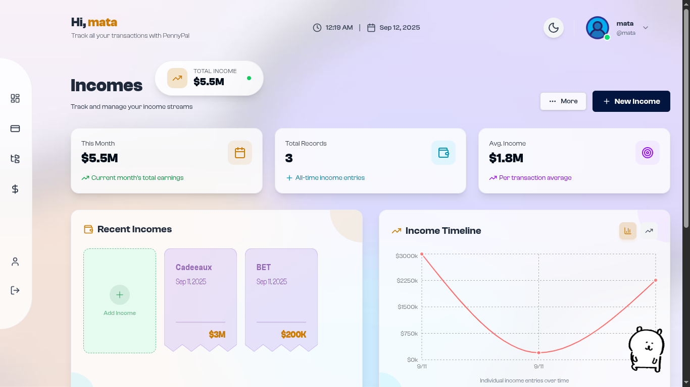
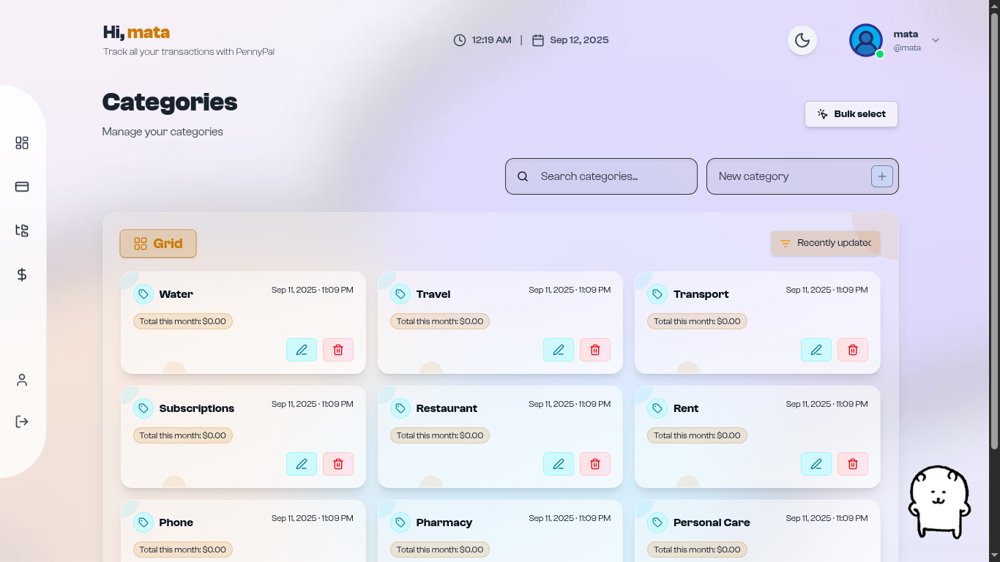
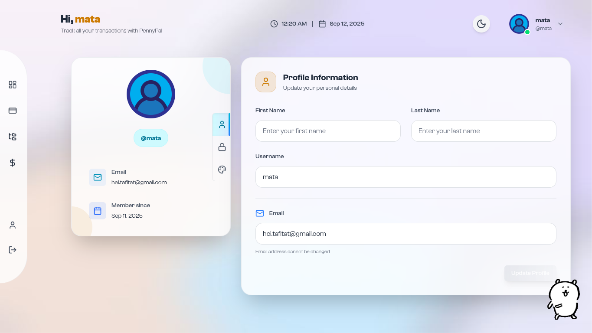

<div align="center">
  <h1 style="margin-bottom: 0.25rem;">Expense Tracker Client</h1>
  <p style="margin-top: 0; color: #6b7280;">Modern React + TypeScript + Vite frontend with a reusable UI library and Storybook docs.</p>
  <p>
    
    
    
    
    
  </p>
  <p>
    
    
    
  </p>
</div>

## Tech Stack

## Table of Contents

- [Tech Stack](#tech-stack)
- [Requirements](#requirements)
- [Scripts](#scripts)
- [API Client SDK](#api-client-sdk)
- [UI Components Overview (`client/src/ui/`)](#ui-components-overview-clientsrcui)
- [Accessibility](#accessibility)
- [Functional Overview (EN)](#functional-overview-en)
  - [Main Routes](#main-routes)
  - [Quick Start](#quick-start)
  - [Configuration / Environment](#configuration--environment)
  - [Architecture Diagram](#architecture-diagram)
  - [Frontend Architecture](#frontend-architecture)
  - [Data Flow](#data-flow)
  - [UI & Theme](#ui--theme)
  - [Key Dependencies](#key-dependencies)
  - [Implementation Notes](#implementation-notes)
  - [Deployment](#deployment)

## Requirements

- Node.js >= 18
- pnpm, npm, or yarn (examples below use npm)

<h2>Scripts</h2>

- dev server: `npm run dev`
- build: `npm run build`
- preview: `npm run preview`
- storybook: `npm run storybook`

<h2>API Client SDK</h2>

- Regenerate the client from the server OpenAPI spec:

```bash
npm run api:generate
```

- Source spec: `server/docs/Expense Tracker API.yaml`

<h2>UI Components Overview (<code>client/src/ui/</code>)</h2>

- Tooltip (`Tooltip.tsx`)
  - Uses shared positioning hook `useAnchoredPopover` for smart placement (top/bottom/left/right), flip and clamp to viewport.
  - A11y: `role="tooltip"`, dynamic `aria-describedby`, subtle motion to reduce distraction.
  - Docs: see `Tooltip.stories.tsx` for placements, delays, disabled listeners, custom classes.

- Dialog (`Dialog.tsx`)
  - Modal centered with backdrop, ESC to close, optional overlay click to close, scroll lock.
  - Content is flexible: supports cards, long lists (use an inner `max-h-[60vh] overflow-auto`).
  - Docs: see `Dialog.stories.tsx` including cards grid and long list examples (copy-paste code provided in docs panel).

- DatePicker, Select, Skeleton, TextField, Button, Toast, IconButton
  - See respective `*.stories.tsx` for usage.

<h3>Shared hooks and constants</h3>
- `hooks/useAnchoredPopover.ts`: shared anchor-based popover positioning for tooltips/menus/popovers.
- `constants/tooltip.ts` and other files in `constants/`: centralized Tailwind classes and UI tokens.

<h2>Folder Structure (excerpt)</h2>

```
client/
  src/ui/
    Tooltip.tsx
    Dialog.tsx
    hooks/useAnchoredPopover.ts
    constants/tooltip.ts
    *.stories.tsx
```

<h2>Accessibility</h2>

- Components aim for sensible roles/aria attributes and keyboard support (e.g., ESC for dialogs).
- Prefer linking labels with `aria-labelledby` / `aria-describedby` where relevant.

<h2>Storybook</h2>

- Run `npm run storybook` and open the browser UI.
- Each story exposes a “Show code”/Docs panel with copy‑paste snippets for quick adoption.

<!-- Internal workflows and branching strategies are managed at the repository level. -->


---

# Functional Overview (EN)

This frontend is a modern React application to manage personal finances:

- 🔐 Authentication (login, signup) with protected routes.
- 📊 Dashboard with KPIs, monthly bar chart and expense pie chart.
- 💸 Expenses: list with filters (date range, category, type), create/edit, refresh, receipt preview.
- 💼 Incomes: list with search/sort/date filters, charts (timeline/cumulative), PDF receipts and export.
- 🗂️ Categories: create/edit inline, single and bulk delete, list/grid views, pagination, search and sorting.
- 👤 Profile: user information, password change, appearance (theme).
- 🤖 Optional AI tips via Gemini when an API key is provided.

## Main Routes

Defined in `src/App.tsx` using `react-router-dom`:

- `/login`, `/signup`, `/auth/callback` — public auth pages.
- Protected by `RequireAuth`:
  - `/` — `Dashboard`
  - `/expenses` — list of expenses
  - `/expenses/new` — create expense
  - `/expenses/:id/edit` — edit expense
  - `/categories` — categories management
  - `/receipts/:expenseId` — receipt preview (image/PDF)
  - `/incomes` — incomes list + charts
  - `/incomes/new` — create income
  - `/incomes/:id/edit` — edit income
  - `/profile` — user profile

Global UI (`Header`, `Sidebar`, `Mascot`, `BackgroundImage`) wraps protected pages. After login, `PostAuthGate` checks if the user must set a `username` and/or initialize categories (guided modals).

## Quick Start

Prerequisites:

- Node.js >= 18
- npm (or pnpm/yarn)
- Backend available at `http://localhost:8080/api` (default)

Install and run:

```bash
npm install
npm run dev
```

Storybook:

```bash
npm run storybook
```

Build and preview:

```bash
npm run build
npm run preview
```

Generate the API SDK from the server OpenAPI:

```bash
npm run api:generate
```

## Configuration / Environment

Example file: `client/.env.example`.

- `VITE_GEMINI_API_KEY` — API key to enable AI tips (`src/components/aiAdvice/*`).

API note: the generated SDK uses `OpenAPI.BASE` (`src/api/core/OpenAPI.ts`) with default `http://localhost:8080/api`. Ensure your backend is reachable there, or adjust build/deployment (proxy, env replacement at build time, or post‑generation tweak if needed).

## Architecture Diagram

```mermaid
flowchart TD
  U[User Browser] -->|HTTP| Client[Client (React + Vite + Tailwind)]

  subgraph Client
    Client --> UI[Reusable UI Components (src/ui)]
    Client --> Hooks[Hooks & Stores (auth, expenses, incomes, categories)]
    Client --> SDK[OpenAPI SDK (src/api)]
    Client --> Svc[Domain Services (IncomeService, CategoryService, PdfExportService)]
    Client --> Guard[RequireAuth]
    Client --> Gate[PostAuthGate]
    Client -. optional .-> AI[Gemini AI (VITE_GEMINI_API_KEY)]
  end

  SDK -->|REST| API[(Backend API /api)]
  API --> DB[(Database)]

  Guard --> Client
  Gate --> Client
```

## Frontend Architecture

- `src/pages/` — feature pages (`Dashboard`, `Expenses`, `Incomes`, `Categories`, `Profile`, etc.).
- `src/components/` — domain components (dashboard, expense, income, categories, auth, common…).
- `src/ui/` — reusable UI library (Button, TextField, Select, DatePicker, Dialog, Tooltip, Toast, etc.) with Storybook stories.
- `src/hooks/` — reusable logic (auth, filters, data fetching, persisted state, etc.).
- `src/api/` — generated OpenAPI client (`DefaultService`, `OpenAPI`, models…).
- `src/services/` — domain services (e.g., `IncomeService`, `CategoryService`, `PdfExportService`).
- `src/stores/` — user store (Zustand) for profile/auth state.
- `src/utils/` — helpers (formatters, totals/evolution computations, highlight, etc.).

### Data Flow

- Hooks like `useExpenses`, `useIncomes`, `useExpenseById`, `useCategories` call services/SDK and expose `loading`, `error`, `data`, plus helpers like `refetch`.
- `RequireAuth` (`src/components/common/RequireAuth.tsx`) relies on `useAuth` to guard routes.
- `PostAuthGate` triggers onboarding modals (username, categories) when needed.

### UI & Theme

Tailwind CSS 4 for utility‑first styling. Reusable components live under `src/ui/` (e.g., inputs, buttons, dialogs, tooltips, toasts) and are documented in Storybook. Icons use `lucide-react`; charts use Recharts.

## Key Dependencies

- React 19, React Router 7, Vite 7, TypeScript 5.
- Tailwind CSS 4.
- Charts: `recharts`.
- PDF/Export: `react-to-pdf`, `jspdf` via `PdfExportService`.
- State: `zustand` for user profile.
- Animations: `framer-motion`.

## Implementation Notes

- `Expenses` and `Incomes` provide filters, sorting, charts and actions (CRUD, receipts). Receipts can be images or PDFs; `ReceiptPreview` handles rendering and download.
- `Categories` provides rich UX: list/grid views, inline edit, bulk select + delete, pagination, search, sorting; powered by `CategoryService` and `useSelection`.
- `Dashboard` summarizes incomes/expenses, shows monthly evolution and category breakdown. Date filters adjust aggregates and cards.

## Deployment

- Can be deployed as a static site (e.g., Vercel). A `vercel.json` is included. Ensure the API URL (`OpenAPI.BASE`) targets your deployed API.
- For multi‑env (dev/staging/prod), consider injecting API URL at build time (env var + post‑generation step if you regenerate the SDK).

## Screenshots


<br />

<br />

<br />

<br />


## Troubleshooting

- API base mismatch: Client SDK uses `http://localhost:8080/api` (see `src/api/core/OpenAPI.ts`). Ensure the server runs on `PORT=8080` or adjust the client base.
- CORS blocked: Set `CORS_ORIGIN=http://localhost:5173` (or your dev URL) in `server/.env` and restart the server.
- Receipt preview blank:
  - PDF: browser viewer blocked by extension/CSP. Try opening the direct URL or check console for CSP errors.
  - Image: ensure the file exists and has correct CORS headers; check the `receipt_url` and content type.
- AI tips disabled: provide `VITE_GEMINI_API_KEY` in `client/.env` or the related UI will remain hidden.

## Override API Base (build-time)

When you regenerate the SDK, `OpenAPI.BASE` resets. Two options:

1) Post‑gen script (package.json):

```bash
# example: replace base after codegen
sed -i 's|BASE: \'.*\'|BASE: '\''https://api.example.com/api'\''|' src/api/core/OpenAPI.ts
```

2) Proxy in dev: use Vite proxy in `vite.config.ts` to forward `/api` to your backend, keeping relative paths in the app.
